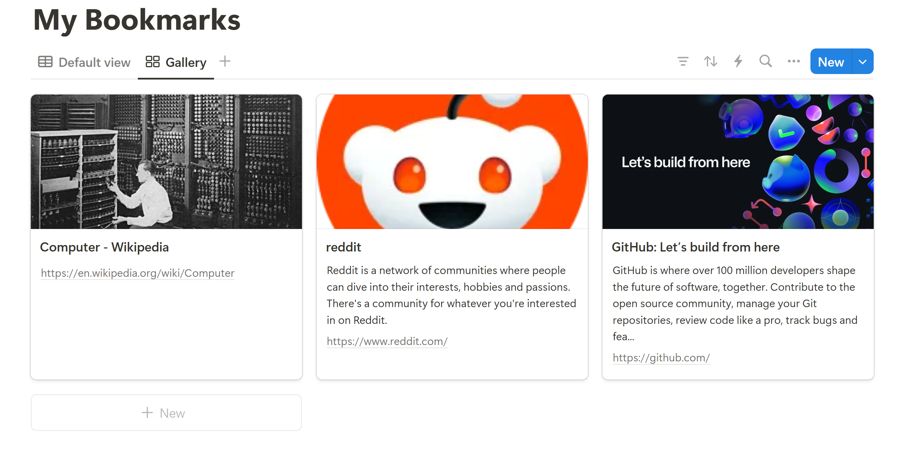
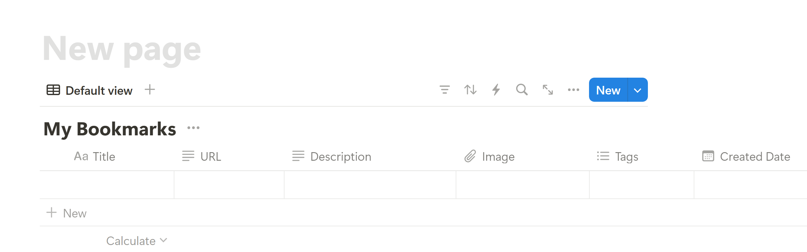

# Notion Bookmarks

Fetches metadata (title, description, image, and URL) from a given website and neatly adds it as a new entry into a **Notion database**.

Can be integrated in a **Telegram bot** or run easily from the **cli**. The only arg is the URL.

## Instructions

#### Create db

Create a new page in Notion, and get the page ID from the URL. From the page's menu, connect it to your [integration](https://developers.notion.com/docs/create-a-notion-integration).

Create a new database using `create_db.py` - fill in the `api_key`, `page_id` in `config.py` first. Keep the database ID from the printed response in `config.py`.

The page will look like this:

On the top right, click '...'/Properties/Sort by 'Created Date'.

Click on '+' to add a Gallery view. Click '...'/Layout/Card Preview and choose the 'Image' property.

#### Insert URLs db

Add entries to the db by running `add_to_db.py`. Click '...'/Properties to edit which properties are shown. db should now look like the first image.

Add more bookmarks by running `main.py <url>`, or add it as an option in a telegram bot. To add more features - it will be easier by using Notion's sdk, unlike here.
